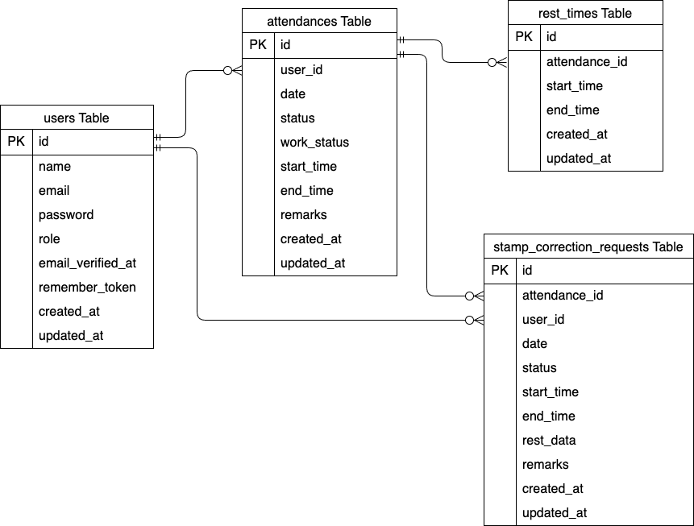

# 勤怠管理システム（Attendance Management System）

## 1. プロジェクト概要
* **どんなアプリか？**：要件定義に基づいた、ユーザーの勤怠と管理を行うアプリ
* **開発目的**：ユーザーの出勤・退勤・休憩時間を管理し、管理者への修正申請などを行うためのアプリ開発
* **開発期間**：2026年4月9日〜2026年5月30日

## 2. 開発環境・動作確認方法

採点者様の手元で動作確認いただくための手順です。

### 使用技術(実行環境)
- **開発言語/フレームワーク**:
  - PHP 8.1.34
  - Laravel 8.83.29
- **データベース**: MySQL 8.0.26
- **インフラ（コンテナ環境）**:
  - Docker / Docker Compose
- **Webサーバー**: nginx 1.21.1
- **管理ツール・その他**:
  - GitHub(バージョン管理)
  - MailHog(メールテスト用)
  - phpMyAdmin(DB管理)
  - VS Code(エディタ)

### 起動手順
## 環境構築
1. リポジトリをクローンし、ディレクトリに移動します。
```bash
git clone https://github.com/saiki-ayaka/attendance-app.git
```
```bash
cd attendance-app
```
2. DockerDesktopアプリを立ち上げる
3. コンテナをビルド・起動します。
```bash
docker-compose up -d --build
```

**Laravel環境構築**
1. PHPコンテナ内に入ります。
```bash
docker-compose exec php bash
```
2. ライブラリをインストールします。
```bash
composer install
```
3. .env.example をコピーして .env を作成します。
   .env を作成したら、DB_PASSWORD の欄にご自身の環境に合わせて設定したパスワードを入力してください

```bash
cp .env.example .env
```

4. .env ファイルの「メール送信設定」を以下のように更新してください。
   MailHog は認証不要で動作するため、MAIL_USERNAME や PASSWORD はそのままで問題ありません。

```text
MAIL_MAILER=smtp
MAIL_HOST=mailhog
MAIL_PORT=1025
MAIL_USERNAME=null
MAIL_PASSWORD=null
MAIL_ENCRYPTION=null
MAIL_FROM_ADDRESS=hello@example.com
MAIL_FROM_NAME="${APP_NAME}"
```

5. アプリケーションキーの作成
``` bash
php artisan key:generate
```

6. ストレージのシンボリックリンク作成（画像表示に必要）
``` bash
php artisan storage:link
```

7. データベースの初期化とテストデータの投入
``` bash
php artisan migrate:fresh --seed
```

### アクセスURL
ローカルサーバー起動後、ブラウザで以下にアクセスしてください。
- 一般ユーザーログイン画面: http://localhost/login
- 一般ユーザー会員登録: http://localhost/register
- 管理者ログイン画面: http://localhost/admin/login

### テスト用アカウント
動作確認の際は、以下の登録済みアカウントをご利用ください。
- メールアドレス1: test@example.com / パスワード: password
- メールアドレス2: test2@example.com / パスワード: password

## 3. データベース設計
データの整合性を保つため、以下の設計に基づいています。
### ER図

### テーブル仕様書

#### usersテーブル (利用ユーザー)
| カラム名 | 型 | PK | UNIQUE | NOT NULL | 説明 |
| :--- | :--- | :---: | :---: | :---: | :--- |
| id | unsigned bigint | ○ | | ○ | ユーザーID |
| name | varchar(255) | | | ○ | ユーザー名 |
| email | varchar(255) | | ○ | ○ | メールアドレス |
| password | varchar(255) | | | ○ | パスワード |
| postcode | varchar(255) | | | | 郵便番号 |
| address | varchar(255) | | | | 住所 |
| building | varchar(255) | | | | 建物名 |
| image_url | varchar(255) | | | | プロフィール画像パス |

#### itemsテーブル (出品商品)
| カラム名 | 型 | PK | NOT NULL | FK | 説明 |
| :--- | :--- | :---: | :---: | :--- | :--- |
| id | unsigned bigint | ○ | ○ | | 商品ID |
| user_id | unsigned bigint | | ○ | users(id) | 出品者ID |
| condition_id | unsigned bigint | | ○ | conditions(id) | 商品状態ID |
| name | varchar(255) | | ○ | | 商品名 |
| description | text | | ○ | | 商品説明 |
| price | unsigned int | | ○ | | 販売価格 |
| image_url | varchar(255) | | ○ | | 商品画像パス |
| brand | varchar(255) | | | | ブランド名 |

#### categoriesテーブル (カテゴリー名)
| カラム名 | 型 | PK | NOT NULL | 説明 |
| :--- | :--- | :---: | :---: | :--- |
| id | unsigned bigint | ○ | ○ | カテゴリーID |
| name | varchar(255) | | ○ | カテゴリー名 |

#### category_itemテーブル (商品-カテゴリー中間テーブル)
| カラム名 | 型 | PK | NOT NULL | FK | 説明 |
| :--- | :--- | :---: | :---: | :--- | :--- |
| item_id | unsigned bigint | ○ | ○ | items(id) | 商品ID |
| category_id | unsigned bigint | ○ | ○ | categories(id) | カテゴリーID |

#### conditionsテーブル (商品状態)
| カラム名 | 型 | PK | NOT NULL | 説明 |
| :--- | :--- | :---: | :---: | :--- |
| id | unsigned bigint | ○ | ○ | 状態ID |
| name | varchar(255) | | ○ | 状態名（良好、傷あり等） |

#### ordersテーブル (注文情報)
| カラム名 | 型 | PK | UNIQUE | NOT NULL | 説明 |
| :--- | :--- | :---: | :---: | :---: | :--- |
| id | unsigned bigint | ○ | | ○ | 注文ID |
| user_id | varchar(255) | | | ○ | 購入者ID |
| item_id | varchar(255) | | ○ | ○ | 商品ID |
| payment_method | varchar(255) | | | ○ | 支払い方法 |
| postcode | varchar(255) | | | ○ | 配送先郵便番号 |
| address | varchar(255) | | | ○ | 配送先住所 |
| building | varchar(255) | | | | 配送先建物名 |

#### favoritesテーブル (お気に入り)
| カラム名 | 型 | PK | NOT NULL | FK | 説明 |
| :--- | :--- | :---: | :---: | :--- | :--- |
| id | unsigned bigint | ○ | ○ | | ID |
| user_id | unsigned bigint | | ○ | users(id) | ユーザーID |
| item_id | unsigned bigint | | ○ | items(id) | 商品ID |
| created_at | timestamp | | | | 作成日時 |
| updated_at | timestamp | | | | 更新日時 |

#### commentsテーブル (コメント)
| カラム名 | 型 | PK | NOT NULL | FK | 説明 |
| :--- | :--- | :---: | :---: | :--- | :--- |
| id | unsigned bigint | ○ | ○ | | ID |
| user_id | unsigned bigint | | ○ | users(id) | ユーザーID |
| item_id | unsigned bigint | | ○ | items(id) | 商品ID |
| comment | text | | ○ | | コメント内容 |


## 4. 主要機能一覧
- ユーザー認証・認可: 登録、ログイン、メール認証、ログアウト機能
- 商品一覧・詳細: 全商品表示、自分以外の出品物のみ表示（マイリスト）、詳細情報閲覧
- 検索・絞り込み: 商品名でのキーワード検索機能
- 商品出品: 画像アップロード、複数カテゴリ選択、状態選択、価格設定
- お気に入り機能: 商品詳細からの登録・解除、マイページでの一覧表示
- コメント機能: 出品者への質問や購入希望者との交流
- 購入・決済機能: Stripe を利用したクレジットカード決済、配送先情報の入力
- プロフィール管理: 住所、プロフィール画像の変更
## 機能一覧
- ユーザー認証（新規登録・ログイン・ログアウト）
- 勤怠記録（出勤・退勤・休憩開始・休憩終了）
- 勤怠一覧表示
- 勤怠詳細表示
- 修正申請機能
- 管理者向け承認機能

## データベース設計
（ここに昨夜作成したER図の画像を貼り付けるか、mermaid記法で追記するとよりプロフェッショナルです！）